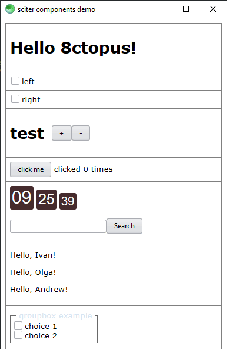

# sciter components

This project is an introduction to [sciter.js](https://sciter.com/) components.

It explores how to build components using `Reactor` which is Sciter's equivalent to [ReactJS](https://reactjs.org/).

All controls except the `checkbox`, `groupbox` and `pagecontrol` come from examples found on the sciter website and documentation. The pagecontrol development was moved [here](https://github.com/8ctopus/sciter-pagecontrol).



## demo

- git clone the repository
- on Linux/Mac `chmod +x install.sh start.sh`
- run `install.bat` (Win) or `./install.sh` (Linux/Mac) to download the latest sciter binaries and the sciter package manager
- install packages `php bin/spm.phar install`
- run `start.bat` (Win) or `./start.sh` (Linux/Mac)

## Components

### basics

Components all extend on the `Element` class. Components are javascript modules therefore they uses strict js syntax.
Here's the simplest example of a component

```css
hello {
    prototype: HelloWorld url("js/helloworld.js");
    display: block;
}
```

```js
export class HelloWorld extends Element
{
    /// Called when element is attached to the DOM tree
    componentDidMount()
    {
        // create html JSX
        const html = <h1>Hello World!</h1>;

        // set element inner content
        this.content(html);
    }
}
```

When the component is attached to the DOM tree, `componentDidMount` is called. Inside it, the inner HTML is created using JSX (see below) and finally added to the DOM tree using `content`.

More info here: [https://sciter.com/tutorial-learn-sciters-html-components-in-5-minutes/](https://sciter.com/tutorial-learn-sciters-html-components-in-5-minutes/)

### methods

The `Element` class contains the following methods that are important for components:

#### lifecycle

- `componentDidMount()` - called once when element is attached to DOM tree
- `componentWillUnmount()` - called once immediately before removal from DOM tree
- `componentUpdate(props)` - patch properties and enqueue rendering

#### rendering

- `content(vnode)` - replace element content by vnode
- `element.patch(vnode[, onlyChildren:true])` - patches content of the element by vnode using rules of React[or]. If second parameter is true, the function patches only children but not the element itself.
- `requestPaint()`
- `clear()`

### events

```jsx
["on eventname"](event) {}
["on eventname at selector"](event, selectorElement) {}
```

where:

- `on ` marks the function as event handler
- eventname is a name of event – either standard HTML’s one like click, input, focus, … or custom event name
- ` at ` - [optional] signifies that selector will follow. selector is CSS selector of child element inside this element. When event handler will be triggered selectorElement argument of the function will get reference to the matching child that generated the event.

### styling

Components can be styled using style sets.

```css
clock {
    prototype: Clock url('clock.js');
    style-set: clock;
}

@set clock {
    :root {
        ...
    }

    span {
        ...
    }
}
```

`:root` stands for the clock element and `:root` is needed for styling the element itself and using other selectors on it like immediate children.

The style set can also be assigned from code:

```jsx
const component = (
    <div styleset={__DIR__ + "clock.css#clock"}>
        <h2>{this.time.toLocaleTimeString()}</h2>
    </div>
);
```

### JSX

All components in this repo use JSX. JSX stands for JavaScript XML and it allows to write HTML code inside javascript.

JSX was directly integrated in sciter's javascript engine, while browsers only support JSX by using the Babel compiler.

#### rules

- A multi-line JSX expression must start on the same line as `=` or `return ` or should be wrapped in parentheses. (The reason of this lies in the famous "Automatic semicolon insertion": https://stackoverflow.com/questions/2846283/what-are-the-rules-for-javascripts-automatic-semicolon-insertion-asi)

```jsx
const component = <p>
    a paragraph
</p>;
```

```jsx
const component = (
    <p> a paragraph </p>
);
```

- A JSX expression must have exactly one outermost element, or use an array, or use a fragment.

```jsx
// doesn't work
const component = (
    <p> first paragraph </p>
    <p> second paragraph </p>
);

// works
const component = (
    <div>
        <p> first paragraph </p>
        <p> second paragraph </p>
    </div>
);

// array alternative that works
const component = [
    <p> first paragraph </p>,
    <p> second paragraph </p>
];

// fragment alternative that also works
const component = <>
    <p> first paragraph </p>
    <p> second paragraph </p>
</>;
```

- JSX does not support “tail-less” HTML tags like: ``, `<input>` or `<br>`, close them with ` />`

```jsx
// doesn't work
<input type="checkbox">

// works
<input type="checkbox" />
```

- variables inside JSX expressions must be enclosed in `{ }`
- JSX doesn't support variable interpolation inside an attribute value

```jsx
// doesn't work
<input type="checkbox" id="{id}" name="{id}" />

// works
<input type="checkbox" id={id} name={id} />
```

- specify state with `state-`

```jsx
const component = 
  <div state-selected={ selected } />
```

- specify component value

```jsx
<checkbox state-value="checked" />
```

- adding literal html content

```jsx
const html = "<b>some</b> literal <i>HTML</i>";
<div state-html={html} />
```

- using a variable for tag name

```jsx
JSX(tagName, {id: "hw"}, ["Hello, world!"]);
```

More rules and examples can be found here

- [Sciter Reactor JSX](https://sciter.com/tutorials/reactor-jsx/)
- [Sciter JSX official documentation](https://github.com/c-smile/quickjspp/blob/master/doc/jsx.md)

## Sublime Text 3 JSX support

[https://packagecontrol.io/packages/Babel](https://packagecontrol.io/packages/Babel)
